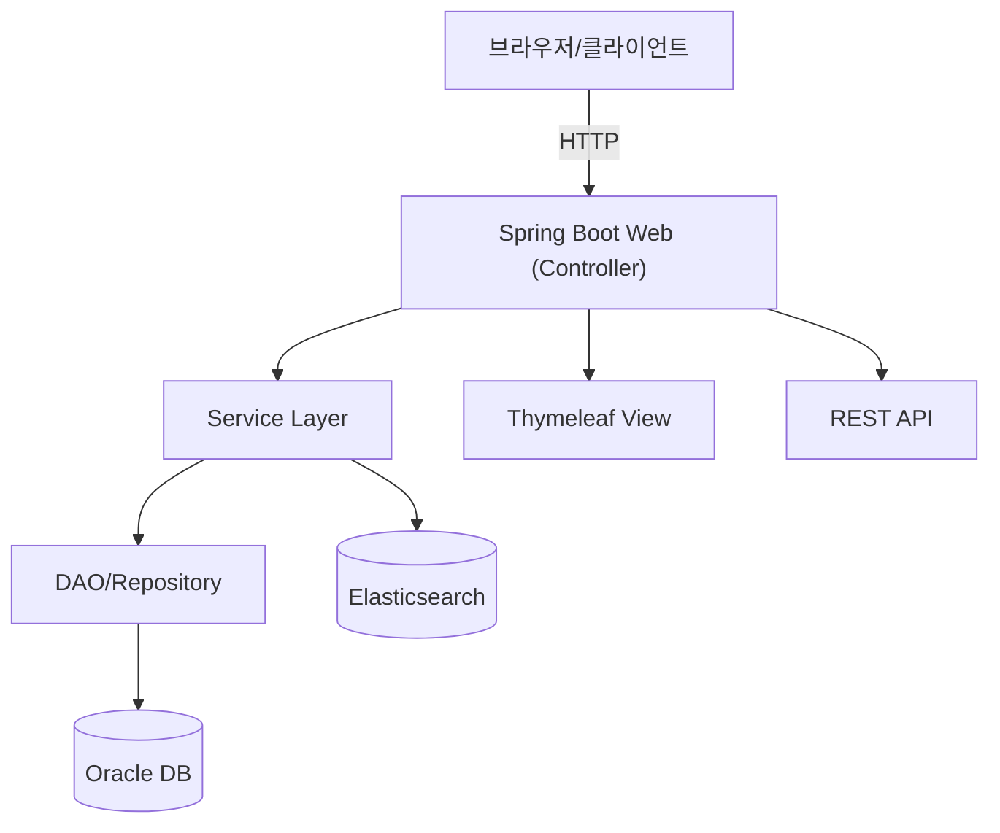
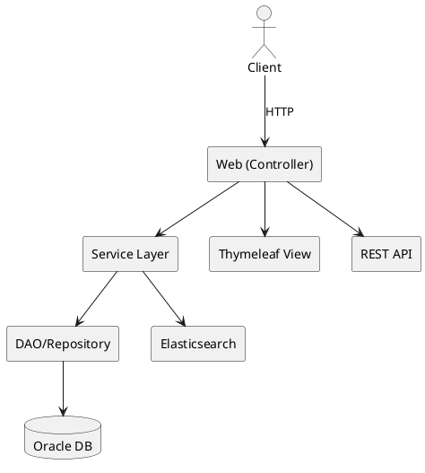
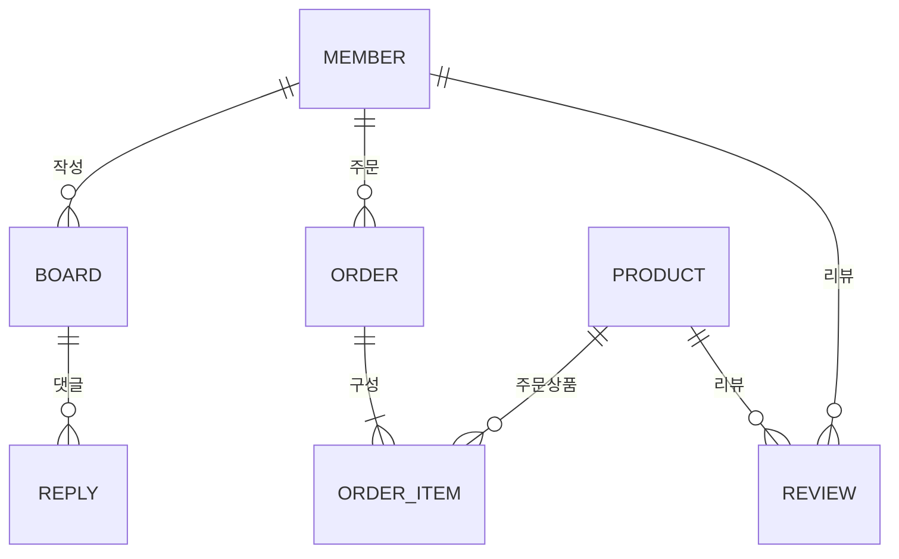
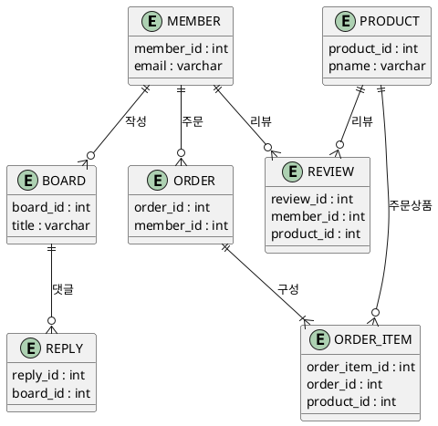
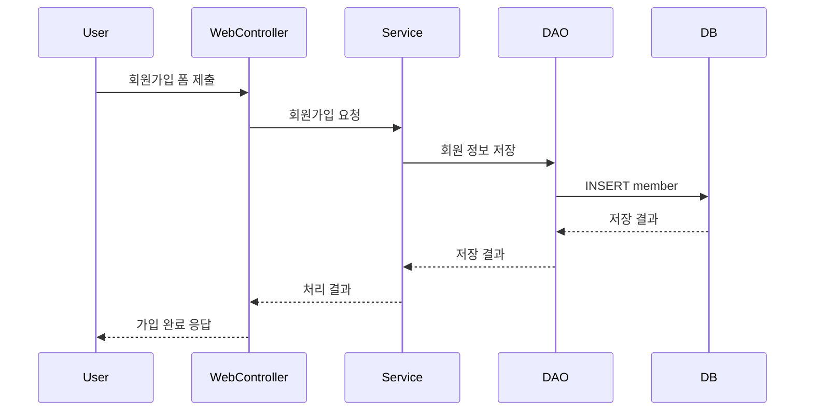
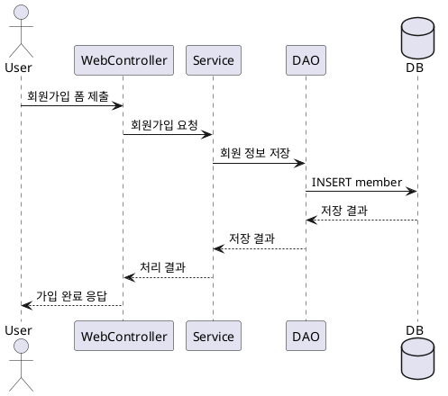

# KDT Demo 프로젝트 구조 및 아키텍처 문서

이 문서는 **Mermaid**와 **PlantUML** 두 가지 다이어그램 문법을 활용해
프로젝트의 전체 구조(아키텍처, ERD, 주요 프로세스)를 비교 설명합니다.

---

## 1. 시스템 아키텍처 (컴포넌트/레이어)

### Mermaid

### PlantUML

---

## 2. ERD (주요 테이블 관계)

### Mermaid

### PlantUML

---

## 3. 주요 프로세스 (회원가입/게시글/댓글)

### Mermaid (회원가입 시퀀스)

### PlantUML (회원가입 시퀀스)

---

## 4. Mermaid vs PlantUML 용도/차이
- **Mermaid**: 마크다운 친화, 빠른 시각화, GitHub/Notion 등에서 바로 지원, 간단한 구조/플로우에 적합
- **PlantUML**: UML 표준, 복잡한 설계, 다양한 다이어그램, 별도 렌더러 필요, 복잡한 시스템 설계에 적합

---

> 위 다이어그램들은 실제 코드/DB 구조와 100% 일치하지 않을 수 있습니다. 
> 상세한 구조/관계/프로세스는 실제 소스와 DB를 참고하세요. 