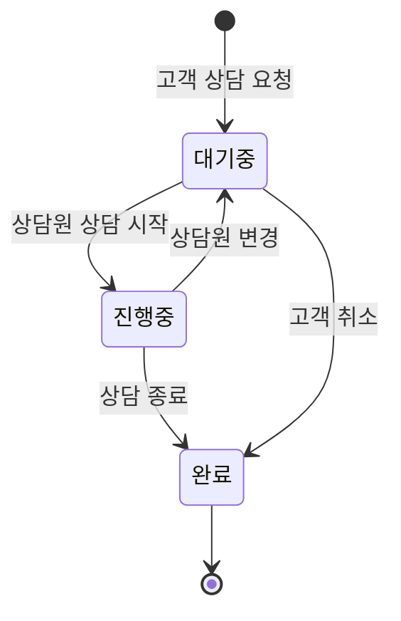
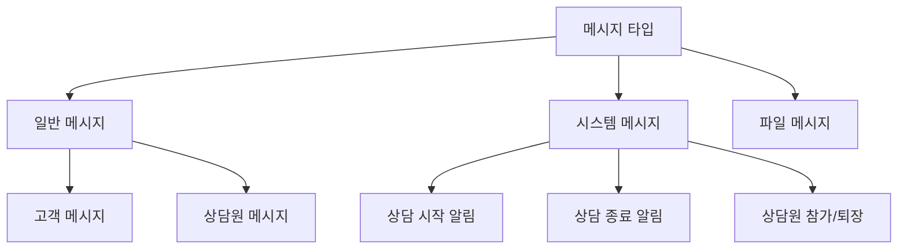
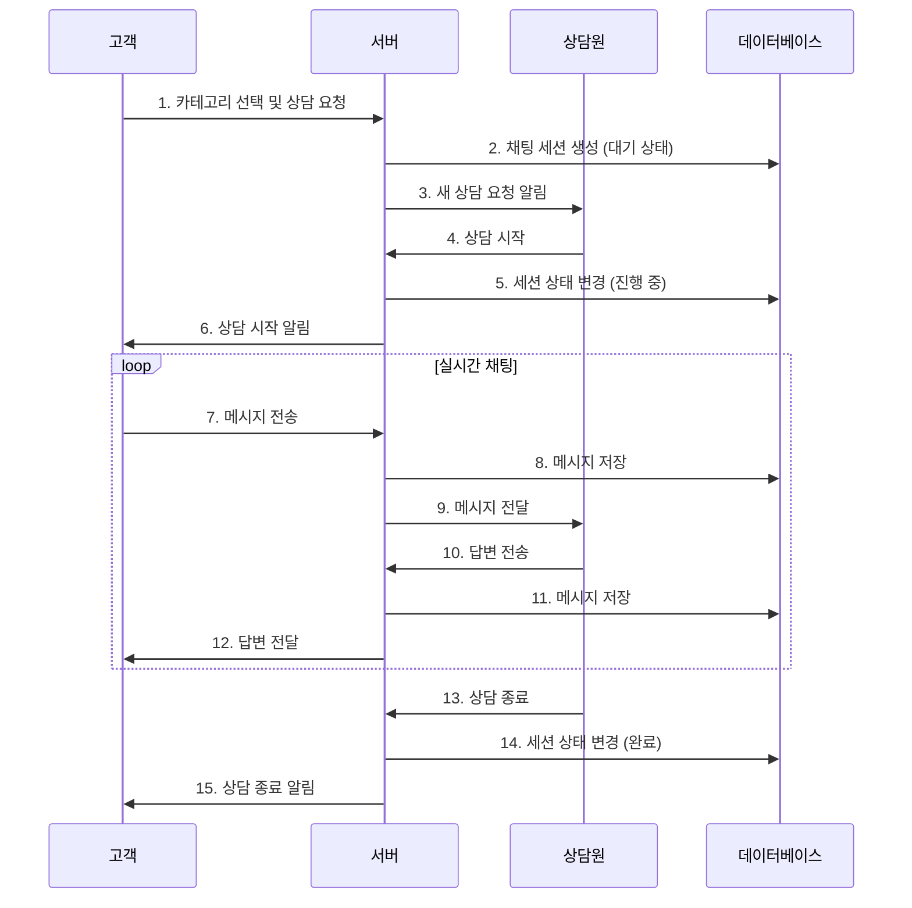
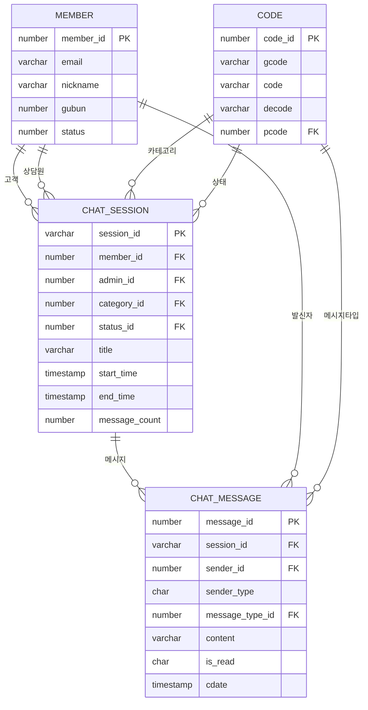
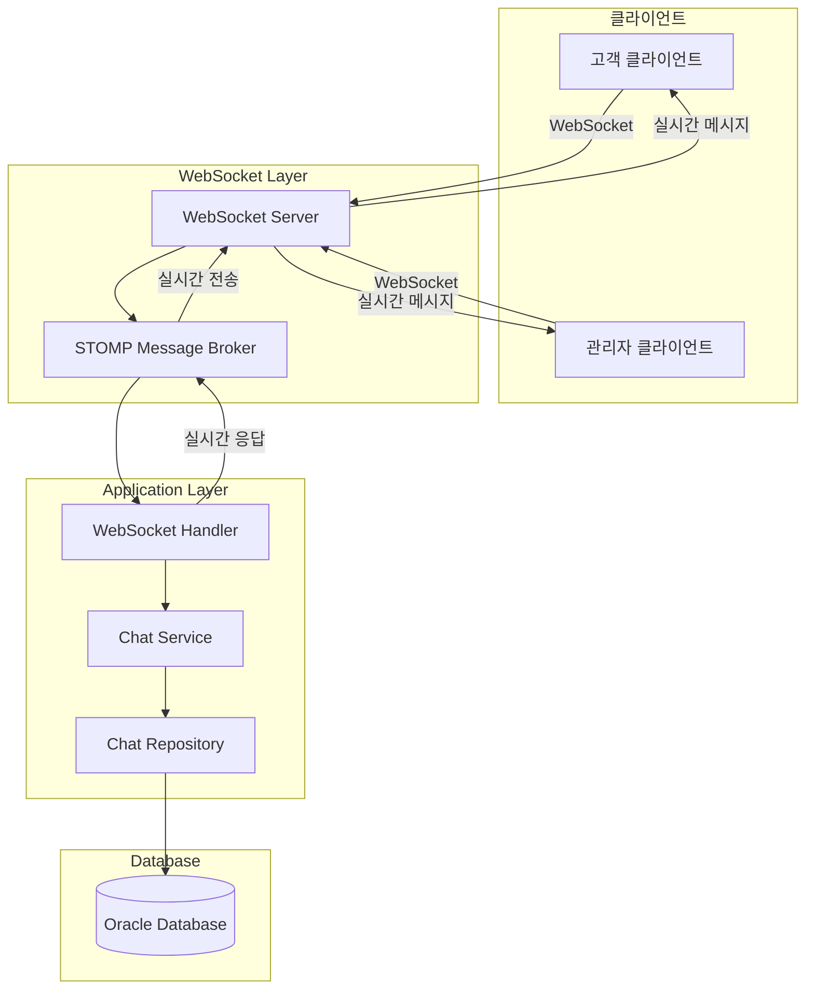
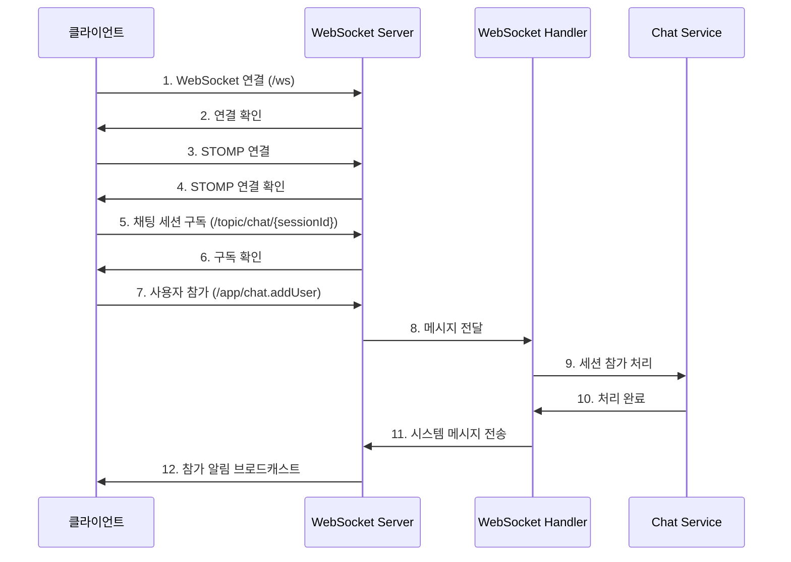
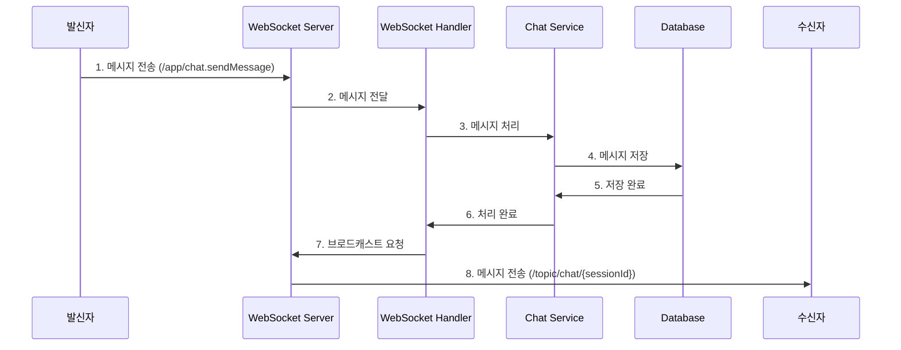
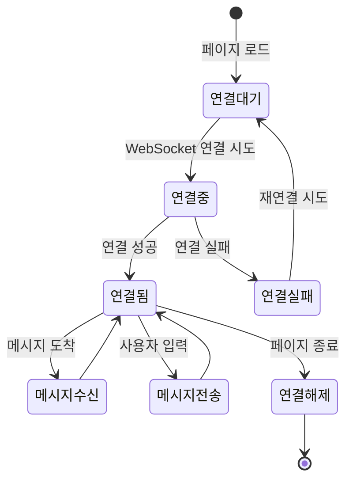
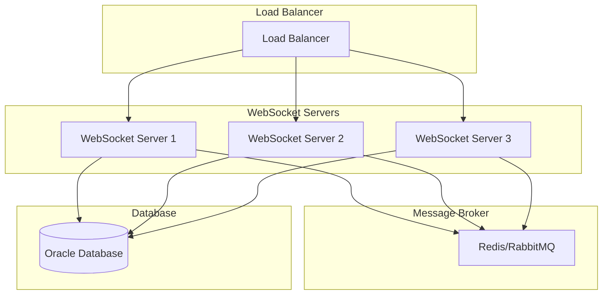

# 1:1 채팅 시스템 문서화

## 목차
1. [시스템 개요](#시스템-개요)
2. [비즈니스 로직](#비즈니스-로직)
3. [데이터베이스 설계](#데이터베이스-설계)
4. [WebSocket 아키텍처](#websocket-아키텍처)
5. [클라이언트-서버 통신](#클라이언트-서버-통신)
6. [코드 구조](#코드-구조)
7. [유지보수 가이드](#유지보수-가이드)

---

## 시스템 개요

### 1.1 시스템 목적
- 고객과 상담원 간의 실시간 1:1 채팅 상담 서비스 제공
- WebSocket 기반 실시간 양방향 통신
- 채팅 세션 관리 및 메시지 히스토리 저장
- 관리자용 채팅 대시보드 제공

### 1.2 주요 기능
- **고객 기능**: 카테고리별 상담 요청, 실시간 채팅, 상담 종료
- **관리자 기능**: 대기 중인 상담 목록, 실시간 채팅, 상담 세션 관리
- **시스템 기능**: 자동 메시지, 세션 상태 관리, 통계 제공

---

## 비즈니스 로직

### 2.1 채팅 세션 생명주기



### 2.2 메시지 타입 분류



### 2.3 채팅 플로우



---

## 데이터베이스 설계

### 3.1 ERD (Entity Relationship Diagram)



### 3.2 테이블 상세 구조

#### 3.2.1 CHAT_SESSION 테이블
```sql
CREATE TABLE chat_session (
    session_id      VARCHAR2(50)   NOT NULL,         -- 채팅 세션 ID (UUID 기반)
    member_id       NUMBER(10)     NOT NULL,         -- 고객 ID
    admin_id        NUMBER(10),                      -- 상담원 ID (NULL: 대기 중)
    category_id     NUMBER(10)     NOT NULL,         -- 문의 카테고리
    status_id       NUMBER(10)     DEFAULT 1,        -- 세션 상태 (1:대기, 2:진행, 3:완료)
    title           VARCHAR2(200),                   -- 채팅 제목
    start_time      TIMESTAMP      DEFAULT CURRENT_TIMESTAMP,
    end_time        TIMESTAMP,                       -- 종료 시간
    message_count   NUMBER(10)     DEFAULT 0,        -- 메시지 수
    cdate           TIMESTAMP      DEFAULT CURRENT_TIMESTAMP,
    udate           TIMESTAMP      DEFAULT CURRENT_TIMESTAMP
);
```

#### 3.2.2 CHAT_MESSAGE 테이블
```sql
CREATE TABLE chat_message (
    message_id      NUMBER(10)     NOT NULL,         -- 메시지 ID
    session_id      VARCHAR2(50)   NOT NULL,         -- 채팅 세션 ID
    sender_id       NUMBER(10)     NOT NULL,         -- 발신자 ID
    sender_type     CHAR(1)        NOT NULL,         -- 발신자 타입 (M:고객, A:관리자, S:시스템)
    message_type_id NUMBER(10)     NOT NULL,         -- 메시지 타입
    content         VARCHAR2(2000) NOT NULL,         -- 메시지 내용
    is_read         CHAR(1)        DEFAULT 'N',      -- 읽음 여부 (Y/N)
    cdate           TIMESTAMP      DEFAULT CURRENT_TIMESTAMP
);
```

### 3.3 코드 테이블 구조

#### 3.3.1 채팅 세션 상태 코드
```sql
-- CHAT_SESSION_STATUS
INSERT INTO code (gcode, code, decode) VALUES 
('CHAT_SESSION_STATUS', 'WAITING', '대기중'),
('CHAT_SESSION_STATUS', 'ACTIVE', '진행중'),
('CHAT_SESSION_STATUS', 'COMPLETED', '완료');
```

#### 3.3.2 메시지 타입 코드
```sql
-- CHAT_MESSAGE_TYPE
INSERT INTO code (gcode, code, decode) VALUES 
('CHAT_MESSAGE_TYPE', 'NORMAL', '일반'),
('CHAT_MESSAGE_TYPE', 'SYSTEM', '시스템'),
('CHAT_MESSAGE_TYPE', 'FILE', '파일');
```

---

## WebSocket 아키텍처

### 4.1 전체 아키텍처



### 4.2 WebSocket 설정 구조

```mermaid
graph LR
    subgraph "WebSocketConfig"
        A[STOMP Endpoint: /ws]
        B[Message Broker: /topic, /queue]
        C[Application Prefix: /app]
        D[User Prefix: /user]
    end
    
    subgraph "Message Destinations"
        E[/topic/chat/{sessionId}]
        F[/topic/admin/notifications]
        G[/queue/messages]
    end
    
    A --> B
    B --> C
    B --> D
    C --> E
    C --> F
    D --> G
```

### 4.3 메시지 라우팅

```mermaid
flowchart TD
    A[클라이언트 메시지] --> B{메시지 타입}
    
    B -->|채팅 메시지| C[/app/chat.sendMessage]
    B -->|사용자 참가| D[/app/chat.addUser]
    B -->|사용자 퇴장| E[/app/chat.removeUser]
    
    C --> F[ChatWebSocketHandler.sendMessage]
    D --> G[ChatWebSocketHandler.addUser]
    E --> H[ChatWebSocketHandler.removeUser]
    
    F --> I[ChatService.sendMessage]
    G --> J[시스템 메시지 생성]
    H --> K[시스템 메시지 생성]
    
    I --> L[데이터베이스 저장]
    J --> M[/topic/chat/{sessionId}]
    K --> M
    
    L --> N[실시간 브로드캐스트]
    N --> M
    M --> O[모든 참가자에게 전송]
```

---

## 클라이언트-서버 통신

### 5.1 연결 프로세스



### 5.2 메시지 전송 프로세스



### 5.3 클라이언트 상태 관리



---

## 코드 구조

### 6.1 패키지 구조

```
com.kh.demo
├── config/
│   └── WebSocketConfig.java          # WebSocket 설정
├── web/
│   └── chat/
│       └── ChatWebSocketHandler.java # WebSocket 메시지 핸들러
├── domain/
│   └── chat/
│       ├── ChatService.java          # 채팅 비즈니스 로직
│       ├── ChatSession.java          # 세션 엔티티
│       ├── ChatMessage.java          # 메시지 엔티티
│       ├── dto/
│       │   ├── ChatMessageDto.java   # 메시지 DTO
│       │   └── ChatSessionDto.java   # 세션 DTO
│       └── repository/
│           ├── ChatSessionRepository.java
│           └── ChatMessageRepository.java
└── resources/
    ├── static/
    │   └── js/
    │       ├── chat/
    │       │   └── customer.js       # 고객용 채팅 클라이언트
    │       └── admin/
    │           └── chat/
    │               └── session.js    # 관리자용 채팅 클라이언트
    └── templates/
        ├── chat/
        │   └── customer.html         # 고객용 채팅 페이지
        └── admin/
            └── chat/
                └── session.html      # 관리자용 채팅 페이지
```

### 6.2 핵심 클래스 설명

#### 6.2.1 WebSocketConfig
```java
@Configuration
@EnableWebSocketMessageBroker
public class WebSocketConfig implements WebSocketMessageBrokerConfigurer {
    // STOMP 엔드포인트 설정
    // 메시지 브로커 설정
    // 애플리케이션 프리픽스 설정
}
```

#### 6.2.2 ChatWebSocketHandler
```java
@Controller
public class ChatWebSocketHandler {
    // 메시지 전송 처리
    // 사용자 참가/퇴장 처리
    // 시스템 메시지 생성
}
```

#### 6.2.3 ChatService
```java
@Service
public class ChatService {
    // 채팅 세션 관리
    // 메시지 저장 및 조회
    // 통계 정보 제공
}
```

---

## 유지보수 가이드

### 7.1 일반적인 문제 해결

#### 7.1.1 WebSocket 연결 실패
```javascript
// 클라이언트 측 연결 확인
if (!this.stompClient || !this.stompClient.connected) {
    console.error('WebSocket 연결이 끊어졌습니다.');
    this.reconnect();
}
```

#### 7.1.2 메시지 전송 실패
```java
// 서버 측 예외 처리
try {
    chatService.sendMessage(messageDto);
} catch (Exception e) {
    log.error("메시지 전송 실패: {}", e.getMessage());
    // 클라이언트에게 오류 응답
}
```

### 7.2 성능 최적화

#### 7.2.1 데이터베이스 인덱스
```sql
-- 세션별 메시지 조회 최적화
CREATE INDEX idx_chat_message_session_cdate 
ON chat_message(session_id, cdate DESC);

-- 상태별 세션 조회 최적화
CREATE INDEX idx_chat_session_status_time 
ON chat_session(status_id, start_time DESC);
```

#### 7.2.2 메시지 캐싱
```java
// Redis를 활용한 메시지 캐싱
@Cacheable(value = "chat_messages", key = "#sessionId")
public List<ChatMessageDto> getSessionMessages(String sessionId) {
    // 메시지 조회 로직
}
```

### 7.3 확장성 고려사항

#### 7.3.1 다중 서버 환경


#### 7.3.2 모니터링 및 로깅
```java
// 채팅 통계 모니터링
@Scheduled(fixedRate = 60000) // 1분마다
public void logChatStatistics() {
    Map<String, Object> stats = chatService.getChatStatistics();
    log.info("채팅 통계: {}", stats);
}
```

### 7.4 보안 고려사항

#### 7.4.1 인증 및 권한
```java
// WebSocket 연결 시 인증 확인
@Override
public void configureClientInboundMessageSecurity(MessageSecurityMetadataSourceRegistry messages) {
    messages
        .simpDestMatchers("/app/chat.sendMessage").authenticated()
        .simpDestMatchers("/topic/chat/**").authenticated();
}
```

#### 7.4.2 메시지 검증
```java
// 메시지 내용 검증
private void validateMessage(ChatMessageDto message) {
    if (message.getContent() == null || message.getContent().trim().isEmpty()) {
        throw new IllegalArgumentException("메시지 내용이 비어있습니다.");
    }
    if (message.getContent().length() > 2000) {
        throw new IllegalArgumentException("메시지가 너무 깁니다.");
    }
}
```

---

## 결론

이 문서는 1:1 채팅 시스템의 전체적인 구조와 구현 방식을 설명합니다. WebSocket 기반의 실시간 통신, 세션 관리, 메시지 저장 등의 핵심 기능이 체계적으로 구현되어 있으며, 확장성과 유지보수성을 고려한 설계가 적용되어 있습니다.

주요 특징:
- **실시간 통신**: WebSocket + STOMP 프로토콜 사용
- **세션 관리**: 상태 기반 세션 생명주기 관리
- **데이터 영속성**: 모든 메시지와 세션 정보 데이터베이스 저장
- **확장성**: 다중 서버 환경 지원 가능한 구조
- **모니터링**: 실시간 통계 및 로깅 시스템

이 시스템을 기반으로 추가 기능 개발이나 성능 최적화를 진행할 수 있습니다.
