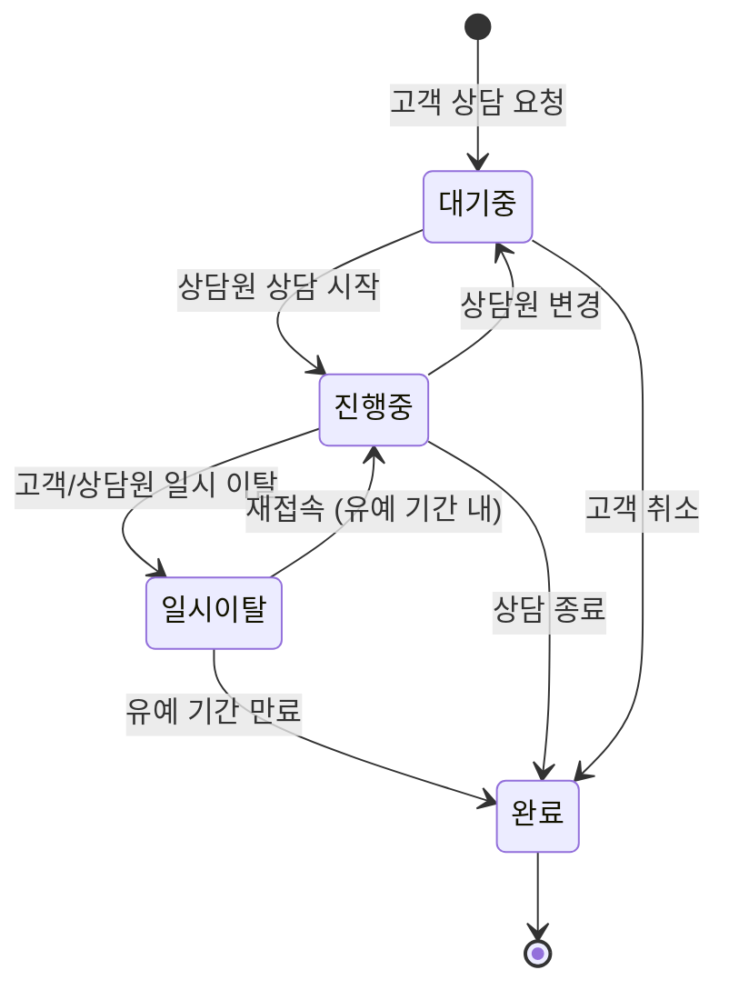
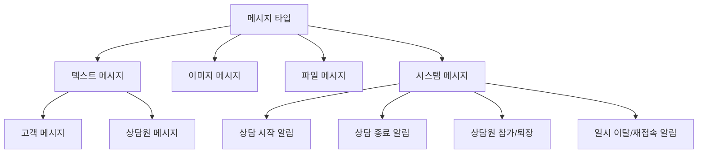
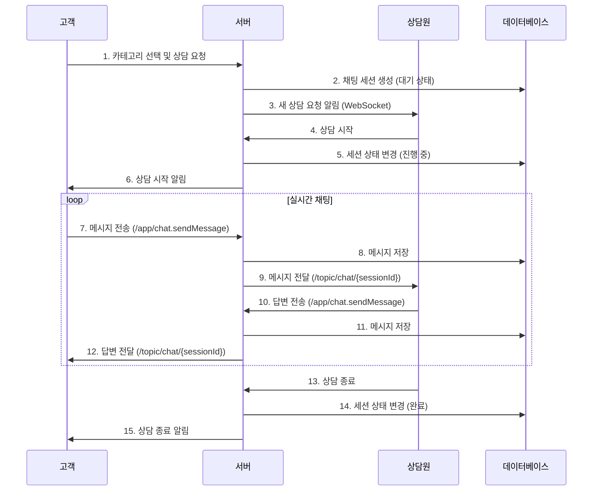
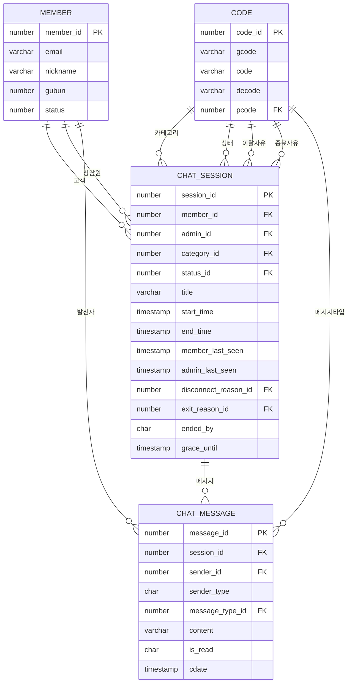
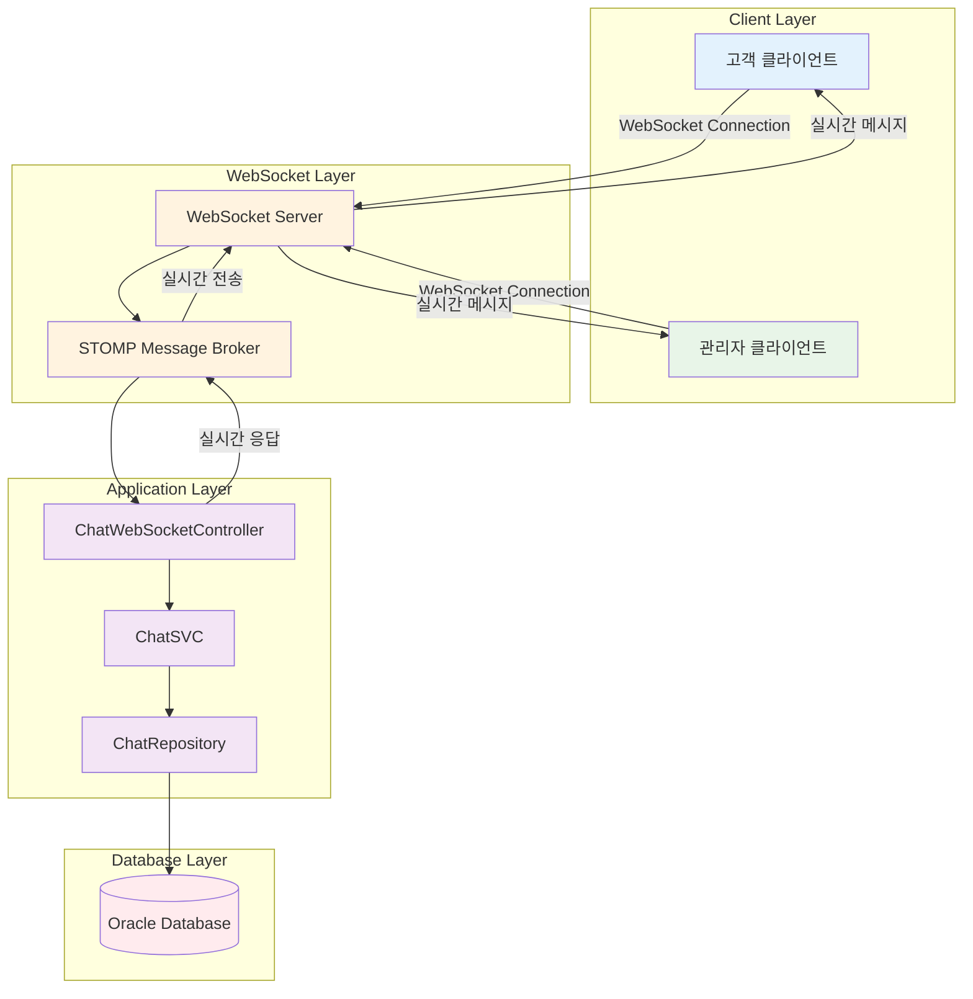
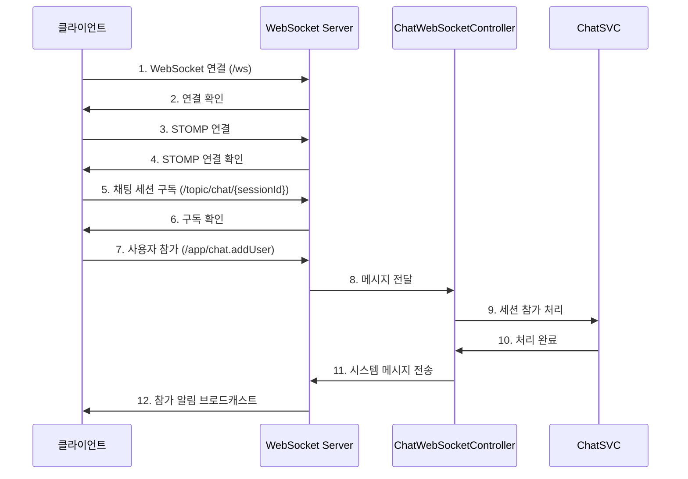
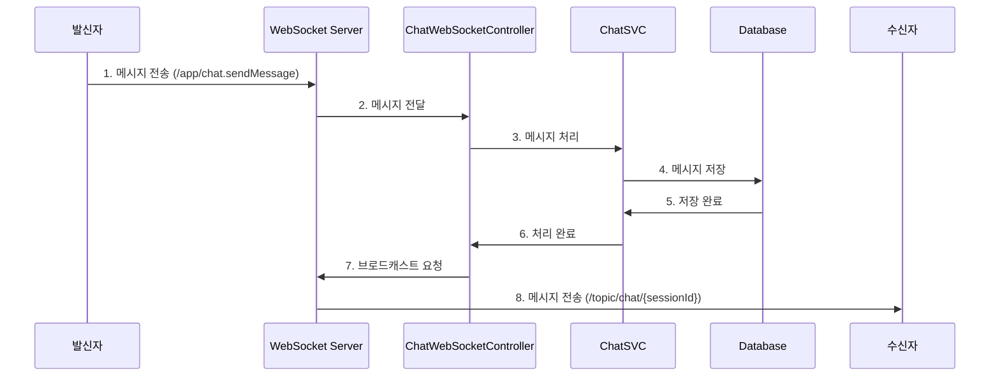
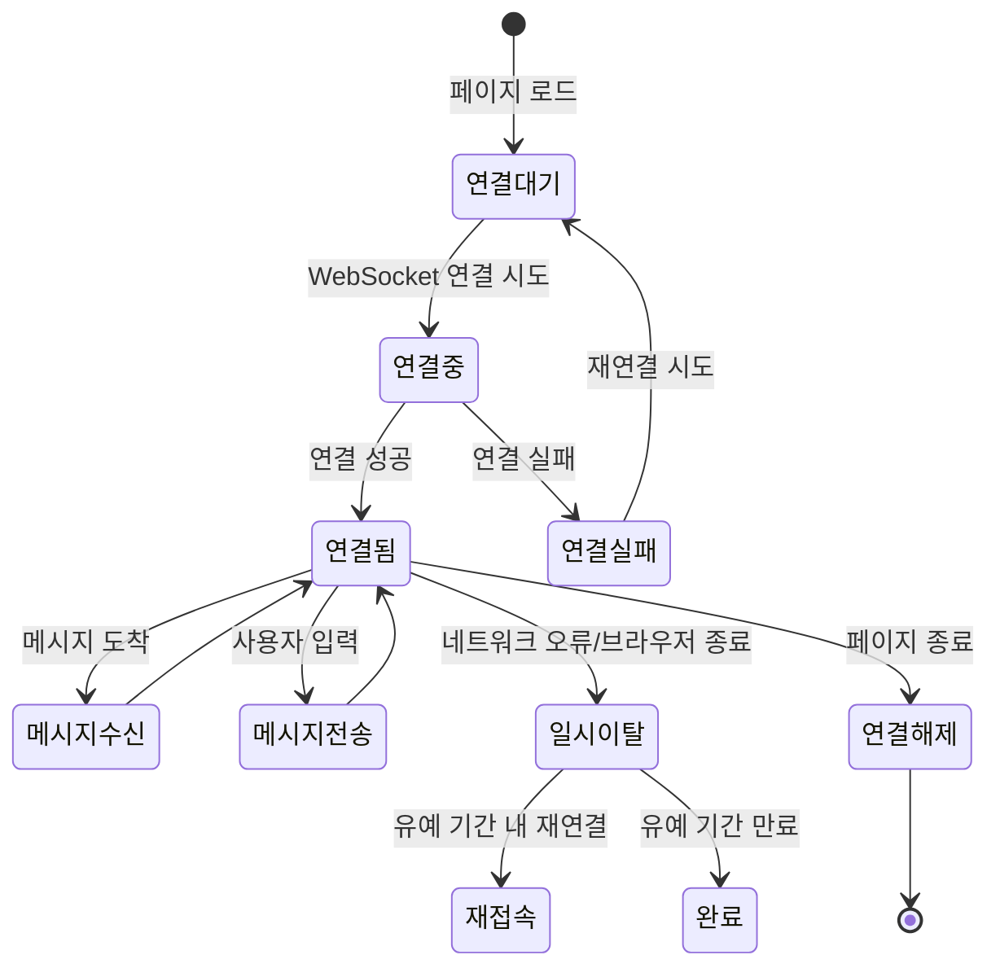
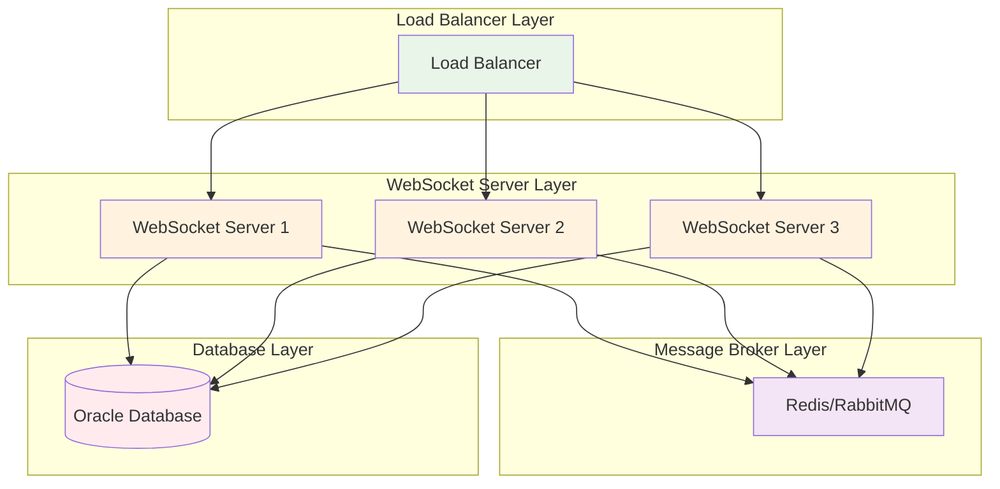

# 1:1 채팅 시스템 문서화

## 목차
1. [시스템 개요](#시스템-개요)
2. [비즈니스 로직](#비즈니스-로직)
3. [데이터베이스 설계](#데이터베이스-설계)
4. [WebSocket 아키텍처](#websocket-아키텍처)
5. [클라이언트-서버 통신](#클라이언트-서버-통신)
6. [코드 구조](#코드-구조)
7. [유지보수 가이드](#유지보수-가이드)

---

## 시스템 개요

### 1.1 시스템 목적
- 고객과 상담원 간의 실시간 1:1 채팅 상담 서비스 제공
- WebSocket 기반 실시간 양방향 통신
- 채팅 세션 관리 및 메시지 히스토리 저장
- 관리자용 채팅 대시보드 및 세션 관리 기능 제공

### 1.2 주요 기능
- **고객 기능**: 카테고리별 상담 요청, 실시간 채팅, 상담 종료
- **관리자 기능**: 대기 중인 상담 목록, 실시간 채팅, 상담 세션 관리, 히스토리 조회
- **시스템 기능**: 자동 메시지, 세션 상태 관리, 통계 제공, 일시 이탈/재접속 처리

---

## 비즈니스 로직

### 2.1 채팅 세션 생명주기



### 2.2 메시지 타입 분류



### 2.3 채팅 플로우



---

## 데이터베이스 설계

### 3.1 ERD (Entity Relationship Diagram)



### 3.2 테이블 상세 구조

#### 3.2.1 CHAT_SESSION 테이블
```sql
CREATE TABLE chat_session (
    session_id      NUMBER(10)     NOT NULL,         -- 채팅 세션 ID
    member_id       NUMBER(10)     NOT NULL,         -- 고객 ID
    admin_id        NUMBER(10),                      -- 상담원 ID (NULL: 대기 중)
    category_id     NUMBER(10)     NOT NULL,         -- 문의 카테고리 (FAQ_CATEGORY 참조)
    status_id       NUMBER(10)     DEFAULT 1 NOT NULL, -- 세션 상태 (CHAT_SESSION_STATUS 참조)
    title           VARCHAR2(200),                   -- 채팅 제목
    start_time      TIMESTAMP      DEFAULT CURRENT_TIMESTAMP, -- 시작시간
    end_time        TIMESTAMP,                       -- 종료시간
    member_last_seen TIMESTAMP,                      -- 고객 마지막 접속 시간
    admin_last_seen  TIMESTAMP,                      -- 상담원 마지막 접속 시간
    disconnect_reason_id NUMBER(10),                 -- 이탈 사유 (CHAT_DISCONNECT_REASON 참조)
    exit_reason_id   NUMBER(10),                     -- 상담 종료 사유 (CHAT_EXIT_REASON 참조)
    ended_by        CHAR(1),                         -- 종료자 타입 (M:고객, A:관리자)
    grace_until     TIMESTAMP,                       -- 유예 만료 시간(재접속 허용 기한)
    cdate           TIMESTAMP      DEFAULT CURRENT_TIMESTAMP,
    udate           TIMESTAMP      DEFAULT CURRENT_TIMESTAMP
);
```

#### 3.2.2 CHAT_MESSAGE 테이블
```sql
CREATE TABLE chat_message (
    message_id      NUMBER(10)     NOT NULL,         -- 메시지 ID
    session_id      NUMBER(10)     NOT NULL,         -- 채팅 세션 ID
    sender_id       NUMBER(10)     NOT NULL,         -- 발신자 ID
    sender_type     CHAR(1)        NOT NULL,         -- 발신자 타입 (M:고객, A:관리자, S:시스템)
    message_type_id NUMBER(10)     NOT NULL,         -- 메시지 타입 (CHAT_MESSAGE_TYPE 참조)
    content         VARCHAR2(2000) NOT NULL,         -- 메시지 내용
    is_read         CHAR(1)        DEFAULT 'N',      -- 읽음 여부 (Y: 읽음, N: 안읽음)
    cdate           TIMESTAMP      DEFAULT CURRENT_TIMESTAMP -- 생성일시
);
```

### 3.3 코드 테이블 구조

#### 3.3.1 채팅 세션 상태 코드
```sql
-- CHAT_SESSION_STATUS
INSERT INTO code (code_id, gcode, code, decode, use_yn, sort_order) VALUES 
(seq_code_id.NEXTVAL, 'CHAT_SESSION_STATUS', 'WAITING', '대기중', 'Y', 1),
(seq_code_id.NEXTVAL, 'CHAT_SESSION_STATUS', 'ACTIVE', '진행중', 'Y', 2),
(seq_code_id.NEXTVAL, 'CHAT_SESSION_STATUS', 'COMPLETED', '완료', 'Y', 3),
(seq_code_id.NEXTVAL, 'CHAT_SESSION_STATUS', 'DISCONNECTED', '일시이탈', 'Y', 4);
```

#### 3.3.2 메시지 타입 코드
```sql
-- CHAT_MESSAGE_TYPE
INSERT INTO code (code_id, gcode, code, decode, use_yn, sort_order) VALUES 
(seq_code_id.NEXTVAL, 'CHAT_MESSAGE_TYPE', 'TEXT', '텍스트', 'Y', 1),
(seq_code_id.NEXTVAL, 'CHAT_MESSAGE_TYPE', 'IMAGE', '이미지', 'Y', 2),
(seq_code_id.NEXTVAL, 'CHAT_MESSAGE_TYPE', 'FILE', '파일', 'Y', 3),
(seq_code_id.NEXTVAL, 'CHAT_MESSAGE_TYPE', 'SYSTEM', '시스템메시지', 'Y', 4);
```

#### 3.3.3 이탈 사유 코드
```sql
-- CHAT_DISCONNECT_REASON
INSERT INTO code (code_id, gcode, code, decode, use_yn, sort_order) VALUES 
(seq_code_id.NEXTVAL, 'CHAT_DISCONNECT_REASON', 'NETWORK_ERROR', '네트워크 오류', 'Y', 1),
(seq_code_id.NEXTVAL, 'CHAT_DISCONNECT_REASON', 'BROWSER_CLOSE', '브라우저 종료', 'Y', 2),
(seq_code_id.NEXTVAL, 'CHAT_DISCONNECT_REASON', 'TIMEOUT', '시간 초과', 'Y', 3);
```

#### 3.3.4 종료 사유 코드
```sql
-- CHAT_EXIT_REASON
INSERT INTO code (code_id, gcode, code, decode, use_yn, sort_order) VALUES 
(seq_code_id.NEXTVAL, 'CHAT_EXIT_REASON', 'RESOLVED', '문제 해결', 'Y', 1),
(seq_code_id.NEXTVAL, 'CHAT_EXIT_REASON', 'CANCELLED', '상담 취소', 'Y', 2),
(seq_code_id.NEXTVAL, 'CHAT_EXIT_REASON', 'TRANSFERRED', '상담 이관', 'Y', 3);
```

---

## WebSocket 아키텍처

### 4.1 전체 아키텍처



### 4.2 WebSocket 설정 구조

```mermaid
graph TB
    subgraph "WebSocket Configuration"
        A[STOMP Endpoint: /ws]
        B[Message Broker: /topic, /queue]
        C[Application Prefix: /app]
        D[User Prefix: /user]
    end
    
    subgraph "Message Destinations"
        E[/topic/chat/{sessionId}]
        F[/topic/admin/notifications]
        G[/topic/chat/sessions]
        H[/topic/chat/new-session]
        I[/topic/chat/messages]
        J[/topic/chat/presence]
    end
    
    A --> B
    B --> E
    B --> F
    B --> G
    B --> H
    B --> I
    B --> J
    C --> B
    D --> B
```

### 4.3 메시지 라우팅

```mermaid
flowchart TD
    A[클라이언트 메시지] --> B{메시지 타입}
    
    B -->|채팅 메시지| C[/app/chat.sendMessage]
    B -->|사용자 참가| D[/app/chat.addUser]
    B -->|사용자 퇴장| E[/app/chat.removeUser]
    B -->|읽음 처리| F[/app/chat.markAsRead]
    
    C --> G[ChatWebSocketController.sendMessage]
    D --> H[ChatWebSocketController.addUser]
    E --> I[ChatWebSocketController.removeUser]
    F --> J[ChatWebSocketController.markAsRead]
    
    G --> K[ChatSVC.sendMessage]
    H --> L[시스템 메시지 생성]
    I --> M[시스템 메시지 생성]
    J --> N[읽음 상태 업데이트]
    
    K --> O[데이터베이스 저장]
    L --> P[/topic/chat/{sessionId}]
    M --> P
    N --> P
    
    O --> Q[실시간 브로드캐스트]
    Q --> P
    P --> R[모든 참가자에게 전송]
    
    style A fill:#e1f5fe
    style B fill:#fff3e0
    style R fill:#e8f5e8
```

---

## 클라이언트-서버 통신

### 5.1 연결 프로세스



### 5.2 메시지 전송 프로세스



### 5.3 클라이언트 상태 관리



---

## 코드 구조

### 6.1 패키지 구조

```
com.kh.demo
├── config/
│   └── WebSocketConfig.java                    # WebSocket 설정
├── web/
│   └── chat/
│       └── controller/
│           ├── page/
│           │   ├── ChatViewController.java     # 고객용 채팅 페이지 컨트롤러
│           │   └── ChatWebSocketController.java # WebSocket 메시지 핸들러
│           └── api/
│               └── ChatApiController.java      # 채팅 REST API
├── admin/
│   └── chat/
│       ├── page/
│       │   └── AdminChatViewController.java    # 관리자용 채팅 페이지 컨트롤러
│       └── api/
│           └── AdminChatApiController.java     # 관리자용 채팅 API
├── domain/
│   └── chat/
│       ├── svc/
│       │   ├── ChatSVC.java                    # 채팅 서비스 인터페이스
│       │   └── ChatSVCImpl.java                # 채팅 서비스 구현체
│       ├── entity/
│       │   ├── ChatSession.java                # 세션 엔티티
│       │   └── ChatMessage.java                # 메시지 엔티티
│       ├── dto/
│       │   ├── ChatMessageDto.java             # 메시지 DTO
│       │   ├── ChatSessionDto.java             # 세션 DTO
│       │   ├── ChatSessionRequest.java         # 세션 요청 DTO
│       │   └── ChatSessionDetailDto.java       # 세션 상세 DTO
│       └── dao/
│           ├── ChatSessionRepository.java      # 세션 Repository 인터페이스
│           ├── ChatSessionRepositoryImpl.java  # 세션 Repository 구현체
│           ├── ChatMessageRepository.java      # 메시지 Repository 인터페이스
│           └── ChatMessageRepositoryImpl.java  # 메시지 Repository 구현체
└── resources/
    ├── static/
    │   ├── css/
    │   │   ├── chat/
    │   │   │   └── customer.css                # 고객용 채팅 스타일
    │   │   └── admin/
    │   │       └── chat/
    │   │           ├── dashboard.css           # 관리자 대시보드 스타일
    │   │           └── session.css             # 관리자 세션 스타일
    │   └── js/
    │       ├── chat/
    │       │   ├── customer.js                 # 고객용 채팅 클라이언트
    │       │   └── popup.js                    # 팝업 채팅 클라이언트
    │       └── admin/
    │           └── chat/
    │               ├── dashboard.js            # 관리자 대시보드 클라이언트
    │               └── session.js              # 관리자 세션 클라이언트
    └── templates/
        ├── chat/
        │   ├── customer.html                   # 고객용 채팅 페이지
        │   └── popup.html                      # 팝업 채팅 페이지
        └── admin/
            └── chat/
                ├── dashboard.html              # 관리자 대시보드 페이지
                ├── session.html                # 관리자 세션 페이지
                ├── history.html                # 관리자 히스토리 페이지
                └── historyDetail.html          # 관리자 히스토리 상세 페이지
```

### 6.2 핵심 클래스 설명

#### 6.2.1 WebSocketConfig
```java
@Configuration
@EnableWebSocketMessageBroker
public class WebSocketConfig implements WebSocketMessageBrokerConfigurer {
    // STOMP 엔드포인트 설정 (/ws)
    // 메시지 브로커 설정 (/topic, /queue)
    // 애플리케이션 프리픽스 설정 (/app)
    // 사용자 프리픽스 설정 (/user)
}
```

#### 6.2.2 ChatWebSocketController
```java
@Controller
public class ChatWebSocketController {
    // 메시지 전송 처리 (/app/chat.sendMessage)
    // 사용자 참가 처리 (/app/chat.addUser)
    // 사용자 퇴장 처리 (/app/chat.removeUser)
    // 읽음 처리 (/app/chat.markAsRead)
    // 시스템 메시지 생성
}
```

#### 6.2.3 ChatSVC
```java
@Service
public class ChatSVCImpl implements ChatSVC {
    // 채팅 세션 관리 (생성, 상태 변경, 종료)
    // 메시지 저장 및 조회
    // 통계 정보 제공
    // 일시 이탈/재접속 처리
    // 히스토리 관리
}
```

#### 6.2.4 ChatSessionRepository
```java
@Repository
public class ChatSessionRepositoryImpl implements ChatSessionRepository {
    // 세션 CRUD 작업
    // 상태별 세션 조회
    // 통계 데이터 조회
    // NamedJdbcTemplate 사용
}
```

#### 6.2.5 ChatMessageRepository
```java
@Repository
public class ChatMessageRepositoryImpl implements ChatMessageRepository {
    // 메시지 CRUD 작업
    // 읽음 상태 관리
    // 세션별 메시지 조회
    // NamedJdbcTemplate 사용
}
```

---

## 유지보수 가이드

### 7.1 일반적인 문제 해결

#### 7.1.1 WebSocket 연결 실패
```javascript
// 클라이언트 측 연결 확인
if (!this.stompClient || !this.stompClient.connected) {
    console.error('WebSocket 연결이 끊어졌습니다.');
    this.reconnect();
}
```

#### 7.1.2 메시지 전송 실패
```java
// 서버 측 예외 처리
try {
    chatSVC.sendMessage(messageDto);
} catch (Exception e) {
    log.error("메시지 전송 실패: {}", e.getMessage());
    // 클라이언트에게 오류 응답
}
```

#### 7.1.3 세션 상태 동기화 문제
```java
// 세션 상태 캐시 새로고침
@PostConstruct
public void init() {
    List<Code> chatStatusCodes = codeSVC.getCodeList("CHAT_SESSION_STATUS");
    if (chatStatusCodes == null || chatStatusCodes.isEmpty()) {
        codeSVC.refreshCache();
        chatStatusCodes = codeSVC.getCodeList("CHAT_SESSION_STATUS");
    }
}
```

### 7.2 성능 최적화

#### 7.2.1 데이터베이스 인덱스
```sql
-- 세션별 메시지 조회 최적화
CREATE INDEX idx_chat_message_session_cdate 
ON chat_message(session_id, cdate DESC);

-- 상태별 세션 조회 최적화
CREATE INDEX idx_chat_session_status_time 
ON chat_session(status_id, start_time DESC);

-- 고객별 세션 조회 최적화
CREATE INDEX idx_chat_session_member 
ON chat_session(member_id);

-- 상담원별 세션 조회 최적화
CREATE INDEX idx_chat_session_admin 
ON chat_session(admin_id);
```

#### 7.2.2 메시지 캐싱
```java
// Redis를 활용한 메시지 캐싱 (향후 구현)
@Cacheable(value = "chat_messages", key = "#sessionId")
public List<ChatMessageDto> getSessionMessages(Long sessionId) {
    // 메시지 조회 로직
}
```

#### 7.2.3 코드 캐싱
```java
// CodeSVC를 통한 코드 캐싱 활용
@PostConstruct
public void init() {
    // CHAT_SESSION_STATUS, CHAT_MESSAGE_TYPE 등 코드 캐싱
    List<Code> chatStatusCodes = codeSVC.getCodeList("CHAT_SESSION_STATUS");
}
```

### 7.3 확장성 고려사항

#### 7.3.1 다중 서버 환경


#### 7.3.2 모니터링 및 로깅
```java
// 채팅 통계 모니터링
@Scheduled(fixedRate = 60000) // 1분마다
public void logChatStatistics() {
    Map<String, Object> stats = chatSVC.getChatStatistics();
    log.info("채팅 통계: {}", stats);
}
```

### 7.4 보안 고려사항

#### 7.4.1 인증 및 권한
```java
// WebSocket 연결 시 인증 확인 (향후 구현)
@Override
public void configureClientInboundMessageSecurity(MessageSecurityMetadataSourceRegistry messages) {
    messages
        .simpDestMatchers("/app/chat.sendMessage").authenticated()
        .simpDestMatchers("/topic/chat/**").authenticated();
}
```

#### 7.4.2 메시지 검증
```java
// 메시지 내용 검증
private void validateMessage(ChatMessageDto message) {
    if (message.getContent() == null || message.getContent().trim().isEmpty()) {
        throw new IllegalArgumentException("메시지 내용이 비어있습니다.");
    }
    if (message.getContent().length() > 2000) {
        throw new IllegalArgumentException("메시지가 너무 깁니다.");
    }
}
```

#### 7.4.3 세션 보안
```java
// 세션 접근 권한 확인
private void validateSessionAccess(Long sessionId, Long memberId) {
    Optional<ChatSessionDto> session = chatSVC.getSession(sessionId);
    if (session.isEmpty()) {
        throw new IllegalArgumentException("존재하지 않는 세션입니다.");
    }
    
    ChatSessionDto sessionDto = session.get();
    if (!sessionDto.getMemberId().equals(memberId) && 
        !sessionDto.getAdminId().equals(memberId)) {
        throw new SecurityException("세션에 접근할 권한이 없습니다.");
    }
}
```

### 7.5 배포 및 운영

#### 7.5.1 환경별 설정
```yaml
# application.yml
spring:
  profiles:
    active: dev
    
# 개발 환경
---
spring:
  config:
    activate:
      on-profile: dev
  datasource:
    url: jdbc:oracle:thin:@localhost:1521:xe
    username: kdt_demo
    password: 1234

# 운영 환경
---
spring:
  config:
    activate:
      on-profile: prod
  datasource:
    url: jdbc:oracle:thin:@prod-db:1521:prod
    username: ${DB_USERNAME}
    password: ${DB_PASSWORD}
```

#### 7.5.2 로그 설정
```xml
<!-- logback-spring.xml -->
<logger name="com.kh.demo.web.chat" level="DEBUG"/>
<logger name="com.kh.demo.domain.chat" level="DEBUG"/>
<logger name="org.springframework.web.socket" level="INFO"/>
```

---

## 결론

이 문서는 현재 프로젝트의 1:1 채팅 시스템의 전체적인 구조와 구현 방식을 설명합니다. 

### 주요 특징:
- **실시간 통신**: WebSocket + STOMP 프로토콜 사용
- **세션 관리**: 상태 기반 세션 생명주기 관리 (대기중 → 진행중 → 일시이탈 → 완료)
- **데이터 영속성**: Oracle Database를 통한 모든 메시지와 세션 정보 저장
- **확장성**: 다중 서버 환경 지원 가능한 구조
- **모니터링**: 실시간 통계 및 로깅 시스템
- **일시 이탈 처리**: 유예 기간을 통한 재접속 허용
- **관리자 기능**: 대시보드, 세션 관리, 히스토리 조회

### 기술 스택:
- **Backend**: Spring Boot 3.4.5, Java 17
- **Database**: Oracle Database 21c, NamedJdbcTemplate
- **WebSocket**: Spring WebSocket + STOMP
- **Frontend**: HTML5, CSS3, Vanilla JavaScript (ES6+)
- **Template Engine**: Thymeleaf 3.1+

### 향후 개선 방향:
1. **Redis 캐싱**: 메시지 및 세션 정보 캐싱
2. **파일 업로드**: 이미지/파일 메시지 지원
3. **푸시 알림**: 브라우저 푸시 알림 기능
4. **AI 챗봇**: 자동 응답 시스템
5. **다중 언어**: 국제화 지원

이 시스템을 기반으로 추가 기능 개발이나 성능 최적화를 진행할 수 있습니다.
