# Database Schema ERD (Entity Relationship Diagram)

## 📊 **전체 데이터베이스 스키마 다이어그램**

```mermaid
erDiagram
    %% ========================================
    %% 코드 관리 (기준 테이블)
    %% ========================================
    code {
        number code_id PK
        varchar gcode
        varchar code
        varchar decode
        number pcode FK
        varchar code_path
        number code_level
        number sort_order
        char use_yn
        timestamp cdate
        timestamp udate
    }

    %% ========================================
    %% 회원 관리
    %% ========================================
    member {
        number member_id PK
        varchar email UK
        varchar passwd
        varchar tel
        varchar nickname
        varchar gender
        date birth_date
        varchar hobby
        number region FK
        number gubun FK
        varchar status
        varchar status_reason
        timestamp status_changed_at
        blob pic
        timestamp cdate
        timestamp udate
    }

    %% ========================================
    %% 상품 관리
    %% ========================================
    products {
        number product_id PK
        varchar pname
        varchar description
        number price
        number rating
        varchar category
        number stock_quantity
        timestamp cdate
        timestamp udate
    }

    %% ========================================
    %% 장바구니 관리
    %% ========================================
    cart {
        number cart_id PK
        number member_id FK
        timestamp cdate
        timestamp udate
    }

    cart_items {
        number cart_item_id PK
        number cart_id FK
        number product_id FK
        number quantity
        number sale_price
        number original_price
        number discount_rate
        timestamp cdate
        timestamp udate
    }

    %% ========================================
    %% 위시리스트
    %% ========================================
    wishlist {
        number wishlist_id PK
        number member_id FK
        number product_id FK
        timestamp cdate
        timestamp udate
    }

    %% ========================================
    %% 주문 관리
    %% ========================================
    orders {
        number order_id PK
        number member_id FK
        varchar order_number UK
        number order_status_id FK
        number total_amount
        number payment_method_id FK
        number payment_status_id FK
        varchar recipient_name
        varchar recipient_phone
        varchar shipping_address
        varchar shipping_memo
        timestamp cdate
        timestamp udate
    }

    order_items {
        number order_item_id PK
        number order_id FK
        number product_id FK
        varchar product_name
        number product_price
        number quantity
        number subtotal
        timestamp cdate
        timestamp udate
    }

    %% ========================================
    %% 결제 관리
    %% ========================================
    payments {
        number payment_id PK
        number order_id FK
        varchar payment_number
        varchar payment_method
        number amount
        varchar status
        varchar card_number
        varchar card_company
        varchar approval_number
        timestamp approved_at
        varchar failure_reason
        varchar refund_reason
        timestamp refunded_at
        timestamp cdate
        timestamp udate
    }

    %% ========================================
    %% 게시판 관리
    %% ========================================
    boards {
        number board_id PK
        number bcategory FK
        varchar title
        varchar email FK
        varchar nickname
        number hit
        clob bcontent
        number pboard_id FK
        number bgroup
        number step
        number bindent
        number like_count
        number dislike_count
        char status
        timestamp cdate
        timestamp udate
    }

    replies {
        number reply_id PK
        number board_id FK
        varchar email FK
        varchar nickname
        varchar rcontent
        number parent_id FK
        number rgroup
        number rstep
        number rindent
        number like_count
        number dislike_count
        char status
        timestamp cdate
        timestamp udate
    }

    %% ========================================
    %% 리뷰 관리
    %% ========================================
    reviews {
        number review_id PK
        number product_id FK
        number member_id FK
        number order_id FK
        number rating
        varchar title
        clob content
        number helpful_count
        number report_count
        number status FK
        timestamp cdate
        timestamp udate
    }

    review_comments {
        number comment_id PK
        number review_id FK
        number member_id FK
        number parent_id FK
        varchar content
        number helpful_count
        number report_count
        number status FK
        timestamp cdate
        timestamp udate
    }

    review_reports {
        number report_id PK
        number review_id FK
        number comment_id FK
        number reporter_id FK
        varchar report_type
        varchar report_reason
        varchar status
        varchar admin_memo
        timestamp cdate
        timestamp udate
    }

    %% ========================================
    %% 알림 관리
    %% ========================================
    notifications {
        number notification_id PK
        number member_id FK
        varchar target_type
        number notification_type_id FK
        varchar title
        varchar message
        varchar target_url
        number target_id
        char is_read
        timestamp created_date
        timestamp read_date
        char use_yn
    }

    %% ========================================
    %% 파일 관리
    %% ========================================
    uploadfile {
        number uploadfile_id PK
        number code FK
        varchar rid
        varchar store_filename
        varchar upload_filename
        varchar fsize
        varchar ftype
        timestamp cdate
        timestamp udate
    }

    %% ========================================
    %% 토큰 관리
    %% ========================================
    tokens {
        number token_id PK
        varchar email
        varchar token_type
        varchar token_value
        timestamp expiry_date
        varchar status
        timestamp cdate
        timestamp udate
    }

    %% ========================================
    %% 신고 관리
    %% ========================================
    reports {
        number report_id PK
        number reporter_id FK
        varchar target_type
        number target_id
        number category_id FK
        varchar reason
        varchar evidence
        varchar status
        varchar admin_notes
        number resolved_by FK
        timestamp resolved_at
        timestamp cdate
        timestamp udate
    }

    report_statistics {
        number stat_id PK
        varchar target_type
        number target_id
        number total_reports
        number pending_count
        number resolved_count
        timestamp last_reported
        timestamp cdate
        timestamp udate
    }

    auto_action_rules {
        number rule_id PK
        varchar target_type
        number report_threshold
        varchar action_type
        number duration_days
        char is_active
        varchar description
        timestamp cdate
        timestamp udate
    }

    %% ========================================
    %% 검색 로그
    %% ========================================
    search_logs {
        number search_log_id PK
        number member_id FK
        varchar keyword
        number search_type_id FK
        number result_count
        varchar search_ip
        timestamp cdate
    }

    %% ========================================
    %% 관계 정의
    %% ========================================

    %% 코드 계층 구조 (자체 참조)
    code ||--o{ code : "parent-child"

    %% 회원 관련
    member ||--o{ cart : "has"
    member ||--o{ wishlist : "has"
    member ||--o{ orders : "places"
    member ||--o{ reviews : "writes"
    member ||--o{ review_comments : "writes"
    member ||--o{ review_reports : "reports"
    member ||--o{ notifications : "receives"
    member ||--o{ reports : "reports"
    member ||--o{ search_logs : "searches"
    member ||--o{ boards : "writes"
    member ||--o{ replies : "writes"
    member ||--o{ tokens : "has"

    %% 상품 관련
    products ||--o{ cart_items : "included_in"
    products ||--o{ order_items : "ordered_in"
    products ||--o{ wishlist : "wished_in"
    products ||--o{ reviews : "reviewed_in"

    %% 장바구니 관련
    cart ||--o{ cart_items : "contains"

    %% 주문 관련
    orders ||--o{ order_items : "contains"
    orders ||--o{ payments : "has"
    orders ||--o{ reviews : "reviewed_for"

    %% 게시판 관련
    boards ||--o{ replies : "has"
    boards ||--o{ boards : "parent-child"
    replies ||--o{ replies : "parent-child"

    %% 리뷰 관련
    reviews ||--o{ review_comments : "has"
    reviews ||--o{ review_reports : "reported_in"
    review_comments ||--o{ review_reports : "reported_in"
    review_comments ||--o{ review_comments : "parent-child"

    %% 코드 참조 관계
    code ||--o{ member : "region"
    code ||--o{ member : "gubun"
    code ||--o{ orders : "order_status"
    code ||--o{ orders : "payment_method"
    code ||--o{ orders : "payment_status"
    code ||--o{ boards : "bcategory"
    code ||--o{ reviews : "status"
    code ||--o{ review_comments : "status"
    code ||--o{ notifications : "notification_type"
    code ||--o{ uploadfile : "code"
    code ||--o{ reports : "category"
    code ||--o{ search_logs : "search_type"

    %% 파일 참조 관계
    uploadfile ||--o{ boards : "attached_to"
    uploadfile ||--o{ reviews : "attached_to"
    uploadfile ||--o{ products : "attached_to"

    %% 신고 통계 관계
    report_statistics ||--o{ reviews : "stats_for"
    report_statistics ||--o{ review_comments : "stats_for"
    report_statistics ||--o{ member : "stats_for"

    %% 자동 조치 규칙
    auto_action_rules ||--o{ reviews : "applies_to"
    auto_action_rules ||--o{ review_comments : "applies_to"
    auto_action_rules ||--o{ member : "applies_to"
```



## 📋 **테이블별 상세 설명**

### **1. 코드 관리 (code)**
- **역할**: 시스템 전체의 코드 관리 (카테고리, 상태, 타입 등)
- **특징**: 계층 구조 지원 (pcode로 부모-자식 관계)
- **주요 용도**: 주문상태, 결제방법, 알림타입, 신고카테고리 등

### **2. 회원 관리 (member)**
- **역할**: 사용자 정보 및 인증 관리
- **특징**: 이메일 기반 로그인, 프로필 사진 지원
- **상태 관리**: ACTIVE, SUSPENDED, WITHDRAWN, PENDING

### **3. 상품 관리 (products)**
- **역할**: 상품 정보 및 재고 관리
- **특징**: 평점 시스템, 카테고리 분류
- **재고 관리**: stock_quantity로 실시간 재고 추적

### **4. 장바구니 시스템**
- **cart**: 회원별 장바구니 (1:1 관계)
- **cart_items**: 장바구니 내 상품 목록
- **특징**: 할인율, 원가/판매가 구분 저장

### **5. 주문 시스템**
- **orders**: 주문 기본 정보
- **order_items**: 주문 상품 상세 (주문 시점 정보 보존)
- **payments**: 결제 정보 및 이력

### **6. 위시리스트 (wishlist)**
- **역할**: 회원별 관심 상품 관리
- **특징**: 회원-상품 1:1 관계 (중복 방지)

### **7. 게시판 시스템**
- **boards**: 게시글 관리 (계층 구조 지원)
- **replies**: 댓글 관리 (대댓글 지원)
- **특징**: 좋아요/싫어요, 조회수, 상태 관리

### **8. 리뷰 시스템**
- **reviews**: 상품 리뷰 (구매 인증 필수)
- **review_comments**: 리뷰 댓글
- **review_reports**: 리뷰/댓글 신고
- **특징**: 평점, 도움됨 수, 신고 수 관리

### **9. 알림 시스템 (notifications)**
- **역할**: 사용자별 알림 관리
- **특징**: 읽음/안읽음 상태, 타겟 URL 지원

### **10. 파일 관리 (uploadfile)**
- **역할**: 첨부파일 관리
- **특징**: 코드별 분류, 원본/저장 파일명 구분

### **11. 토큰 관리 (tokens)**
- **역할**: 이메일 인증, 비밀번호 재설정 등
- **특징**: 만료일시, 토큰 타입별 관리

### **12. 신고 시스템**
- **reports**: 신고 정보
- **report_statistics**: 신고 통계
- **auto_action_rules**: 자동 조치 규칙
- **특징**: 신고 임계값에 따른 자동 조치

### **13. 검색 로그 (search_logs)**
- **역할**: 검색 이력 및 인기 검색어 분석
- **특징**: 회원별 개인화, IP 추적

## 🔗 **주요 관계 패턴**

### **1. 회원 중심 관계**
```
member → cart, wishlist, orders, reviews, boards, notifications
```

### **2. 상품 중심 관계**
```
products → cart_items, order_items, wishlist, reviews
```

### **3. 주문 중심 관계**
```
orders → order_items, payments, reviews
```

### **4. 게시판 계층 구조**
```
boards → replies (계층 구조)
boards → boards (답글 구조)
```

### **5. 리뷰 계층 구조**
```
reviews → review_comments (계층 구조)
review_comments → review_comments (대댓글)
```

## 📊 **데이터 무결성 특징**

### **1. 외래키 제약조건**
- 모든 관계가 명시적으로 정의됨
- CASCADE 삭제 방지 (안전성 우선)

### **2. 체크 제약조건**
- 성별: M/F만 허용
- 상태값: 미리 정의된 값만 허용
- 수량/가격: 양수만 허용

### **3. 유니크 제약조건**
- 이메일: 회원당 하나
- 주문번호: 중복 방지
- 장바구니: 회원당 하나
- 위시리스트: 회원-상품 조합 중복 방지

### **4. 인덱스 최적화**
- 조회 성능을 위한 복합 인덱스
- 날짜 기반 정렬 인덱스
- 검색 성능을 위한 키워드 인덱스

이 ERD는 전자상거래 플랫폼의 모든 핵심 기능을 포함하는 완전한 데이터베이스 스키마를 보여줍니다. 🏪✨ 